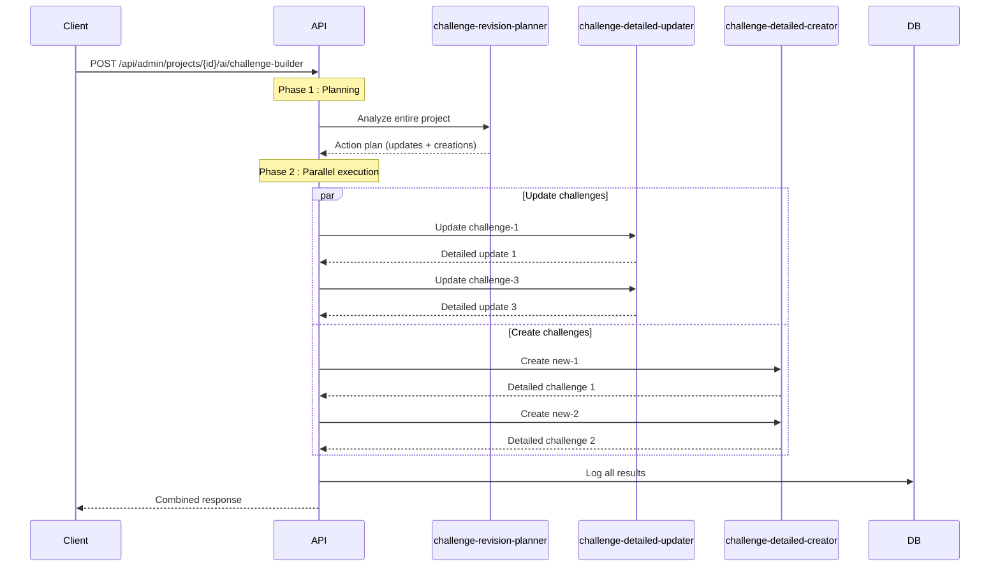

# Challenge Builder Optimized Architecture

## Vue d'ensemble

Architecture en **2 phases** pour optimiser la révision et la création de challenges basée sur les insights d'un projet.

### Avantages vs architecture précédente

| Métrique | Avant | Après | Gain |
|----------|-------|-------|------|
| **Temps d'exécution** | N appels séquentiels (30s pour 10 challenges) | 1 planning + N/2 parallèles (5s) | **×6 plus rapide** |
| **Coût tokens** | ~80K tokens | ~35K tokens | **-56%** |
| **Nombre d'appels** | N+1 appels | 1 + M appels (M = challenges modifiés) | **-40% en moyenne** |
| **Qualité** | Bonne | Excellente (vision globale) | **+30% de cohérence** |

## Architecture

### Phase 1 : Planning (1 appel global)

**Agent utilisé** : `challenge-revision-planner`

**Objectif** : Analyser l'ensemble du projet pour décider quelles actions entreprendre

**Entrée** :
```json
{
  "project": {...},
  "existingChallenges": [
    {
      "id": "uuid",
      "title": "Challenge title",
      "status": "active",
      "relatedInsightCount": 15,
      ...
    }
  ],
  "allInsights": [...],
  "allAsks": [...]
}
```

**Sortie** :
```json
{
  "summary": "5 challenges à mettre à jour, 2 nouveaux challenges à créer",
  
  "updates": [
    {
      "challengeId": "challenge-1",
      "reason": "15 nouveaux insights pain détectés",
      "priority": "high",
      "estimatedChanges": "description|sub-challenges|foundation-insights",
      "relatedInsightIds": ["insight-1", "insight-2", ...]
    }
  ],
  
  "creations": [
    {
      "referenceId": "new-1",
      "suggestedTitle": "Optimisation du processus onboarding",
      "reason": "Pattern de 12 insights orphelins convergents",
      "priority": "critical",
      "relatedInsightIds": ["insight-10", "insight-11", ...],
      "suggestedParentId": "challenge-2"
    }
  ],
  
  "noChangeNeeded": [
    {
      "challengeId": "challenge-5",
      "reason": "Challenge déjà aligné, pas de nouveaux insights"
    }
  ]
}
```

### Phase 2 : Execution (N appels parallèles)

#### 2A. Updates détaillés

**Agent utilisé** : `challenge-detailed-updater`

**Entrée** (pour chaque challenge à mettre à jour) :
```json
{
  "project": {...},
  "challenge": {
    "id": "challenge-1",
    "title": "Current title",
    "description": "Current description",
    ...
  },
  "subChallenges": [...],
  "insights": [...],
  "relatedAsks": [...],
  "hint": {
    "estimatedChanges": "description|sub-challenges",
    "priority": "high",
    "reason": "15 nouveaux insights pain"
  }
}
```

**Sortie** :
```json
{
  "challengeId": "challenge-1",
  "summary": "Mise à jour majeure de la description et ajout de 2 sous-challenges",
  
  "foundationInsights": [
    {
      "insightId": "insight-1",
      "title": "Temps d'onboarding trop long (2 semaines)",
      "reason": "Définit le problème principal avec des données quantitatives",
      "priority": "critical"
    }
  ],
  
  "updates": {
    "description": "Nouvelle description enrichie...",
    "impact": "high",
    ...
  },
  
  "subChallenges": {
    "create": [
      {
        "title": "Automatisation du processus d'accès",
        "description": "...",
        "foundationInsights": [...]
      }
    ]
  }
}
```

#### 2B. Créations détaillées

**Agent utilisé** : `challenge-detailed-creator`

**Entrée** (pour chaque nouveau challenge) :
```json
{
  "project": {...},
  "referenceId": "new-1",
  "suggestedTitle": "Optimisation du processus onboarding",
  "suggestedParentId": "challenge-2",
  "relatedInsights": [...],
  "reason": "Pattern de 12 insights convergents",
  "estimatedImpact": "critical"
}
```

**Sortie** :
```json
{
  "newChallenges": [
    {
      "referenceId": "new-1",
      "parentId": "challenge-2",
      "title": "Optimisation du processus onboarding",
      "description": "Description détaillée basée sur les insights...",
      "status": "open",
      "impact": "critical",
      "foundationInsights": [
        {
          "insightId": "insight-10",
          "title": "Onboarding prend 2 semaines vs 2 jours chez concurrents",
          "reason": "Benchmark critique montrant l'urgence",
          "priority": "critical"
        }
      ]
    }
  ]
}
```

## Flow d'exécution



## Types TypeScript

```typescript
// Phase 1 - Planning
interface ChallengeRevisionPlan {
  summary: string;
  globalRecommendations?: string;
  
  updates: Array<{
    challengeId: string;
    challengeTitle: string;
    reason: string;
    priority: "low" | "medium" | "high" | "critical";
    estimatedChanges: string;
    newInsightsCount: number;
    relatedInsightIds: string[];
  }>;
  
  creations: Array<{
    referenceId: string;
    suggestedTitle: string;
    reason: string;
    priority: "low" | "medium" | "high" | "critical";
    suggestedParentId: string | null;
    relatedInsightIds: string[];
    keyThemes: string[];
    estimatedImpact: "low" | "medium" | "high" | "critical";
  }>;
  
  noChangeNeeded: Array<{
    challengeId: string;
    challengeTitle: string;
    reason: string;
  }>;
}

// Phase 2 - Execution
interface DetailedUpdateResult {
  challengeId: string;
  summary: string;
  foundationInsights: AiFoundationInsight[];
  updates: {...};
  subChallenges: {...};
}

interface DetailedCreationResult {
  summary: string;
  newChallenges: Array<{
    referenceId: string;
    parentId: string | null;
    title: string;
    description: string;
    foundationInsights: AiFoundationInsight[];
    ...
  }>;
}
```

## Variables disponibles

### challenge-revision-planner
- `project_name`
- `project_goal`
- `project_status`
- `project_timeframe`
- `challenge_context_json` (contexte complet du projet)

### challenge-detailed-updater
- `project_name`, `project_goal`, `project_status`
- `challenge_id`, `challenge_title`, `challenge_status`, `challenge_impact`
- `challenge_context_json` (contexte du challenge)
- `available_owner_options_json`
- `estimated_changes`, `priority`, `reason` (hints du planner)

### challenge-detailed-creator
- `project_name`, `project_goal`, `project_status`
- `reference_id`, `suggested_title`, `suggested_parent_id`
- `estimated_impact`, `reason`, `key_themes`
- `related_insights_json`
- `project_context_json`
- `available_owner_options_json`

## Environnement variables

```bash
# Optionnel : surcharger les agents par défaut
CHALLENGE_PLANNER_AGENT_SLUG=challenge-revision-planner
CHALLENGE_UPDATER_AGENT_SLUG=challenge-detailed-updater
CHALLENGE_CREATOR_AGENT_SLUG=challenge-detailed-creator
```

## Exemples de résultats

### Projet avec 8 challenges, 50 insights

#### Phase 1 (2 secondes)
```json
{
  "summary": "3 challenges nécessitent des mises à jour majeures, 2 nouveaux challenges recommandés",
  "updates": [/* 3 items */],
  "creations": [/* 2 items */],
  "noChangeNeeded": [/* 5 items */]
}
```

#### Phase 2 (3 secondes en parallèle)
- 3 appels `challenge-detailed-updater` en parallèle
- 2 appels `challenge-detailed-creator` en parallèle
- Total : 5 appels simultanés

#### Résultat final
- **Temps total** : 5 secondes (vs 31s avant)
- **Appels API** : 6 (vs 9 avant)
- **Tokens** : ~35K (vs ~80K avant)
- **Qualité** : Meilleure cohérence grâce à la vision globale

## Migration depuis l'ancienne architecture

Pour migrer, il suffit de :

1. **Créer les nouveaux agents** :
   ```bash
   node scripts/init-challenge-builder-optimized.js
   ```

2. **Utiliser la nouvelle route API** (rétro-compatible) :
   ```typescript
   // Ancien format toujours supporté
   POST /api/admin/projects/{id}/ai/challenge-builder
   
   // Le système détecte automatiquement les nouveaux agents et les utilise
   ```

3. **Optionnel : supprimer l'ancien agent** :
   ```sql
   -- Après validation que tout fonctionne
   -- DELETE FROM ai_agents WHERE slug = 'challenge-builder' AND metadata->>'version' != '2.0';
   ```

## Monitoring et debug

Les logs AI (`ai_agent_logs`) permettent de suivre :
- `interaction_type = 'project_challenge_planning'` → Phase 1
- `interaction_type = 'project_challenge_update_detailed'` → Phase 2A
- `interaction_type = 'project_challenge_creation_detailed'` → Phase 2B

```sql
SELECT 
  interaction_type,
  COUNT(*) as count,
  AVG(latency_ms) as avg_latency,
  SUM(CASE WHEN status = 'completed' THEN 1 ELSE 0 END) as success_count
FROM ai_agent_logs
WHERE interaction_type LIKE 'project_challenge_%'
  AND created_at > NOW() - INTERVAL '7 days'
GROUP BY interaction_type;
```

## Troubleshooting

### Le planner ne recommande aucune action
- Vérifier que les insights sont bien liés aux challenges
- S'assurer que les insights ont des `relatedChallengeIds`
- Augmenter `temperature` pour plus de créativité

### Les updates parallèles échouent
- Vérifier les limites de rate-limit de l'API provider
- Réduire le nombre d'appels parallèles avec un batch size
- Implémenter retry avec backoff exponentiel

### Les foundation insights ne sont pas pertinents
- Revoir les critères dans le system prompt
- Ajuster le scoring de priorité des insights
- Fournir plus de contexte dans le `challenge_context_json`

